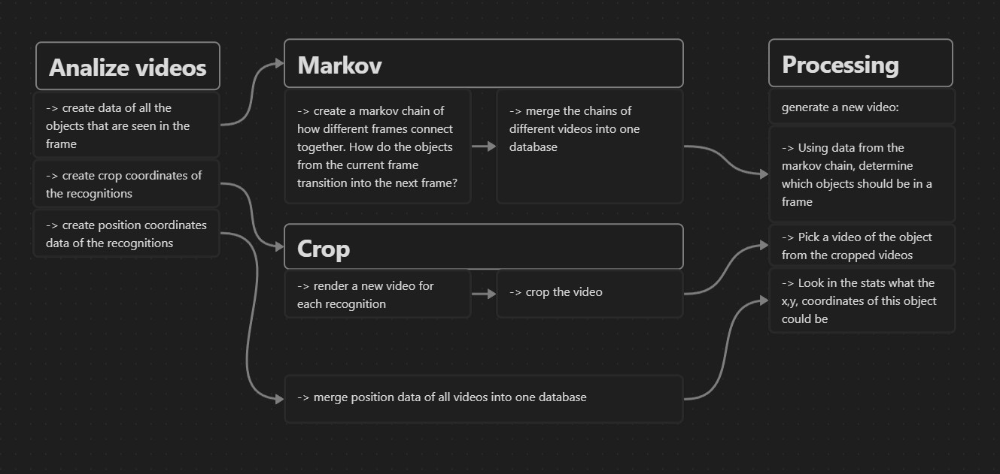

The code for the recognitions in forked from: 
https://github.com/RizwanMunawar/yolov7-object-tracking

This `detect_and_track.py` script was changed (renamed to `detect_and_track_JSON.py`) to save the data to txt and csv files that can later be used in a Processing sketch.

The flow of the data is descibed in the following diagram:



To render a video, run the sketch from the `processing/jsonsens/` directory.

---
The command to run the individual steps:
# crop

(windows)
-> start the terminal in venv

1. Generate the csv files (yeah it says json):
```
python detect_and_track_JSON.py --source "./sourceVideos/vj-tophu/braindead-535.mp4"
```
-> this will put data in `./runs/detect/sourceVideos/...etc`

2. render them:
```
python gpu.py --source "sourceVideos/vj-tophu/braindead-535.mp4"
```

3. crop them
```
python crop-ffmpeg.py --source "./sourceVideos/vj-tophu/${file.name}
```


# markov

create a `chain.json`:
```
node chainJson.mjs "./runs/detect/sourceVideos/vj-tophu/high-998.mp4/chain.txt"
```

use `./markov/mergeJson.js`  to merge json chain files

create a  stats file:
```
node statsJson.mjs "./runs/detect/sourceVideos/vj-tophu/high-998.mp4/"
```


# util

 ### list all files: (i started using Deno over Node halfway in the project)
 ```
 Deno run --allow-all getFiles.js
 ```

Run many scripts at one (change contents):
 ```
 batchCrop.bat
 ```

# (bonus) scene detect
https://github.com/NapoleonWils0n/ffmpeg-scripts

create cuts:
```
 bash scene-detect.sh -i high.mp4 -t 0.2 -o gocuts.txt
 ```

convert the cutlist:
 ```
 bash scene-time.sh -i mensiscuts.txt -o mensisCutlist.txt
 ```

 crop

 ```
 bash scene-cut.sh -i TophuGo.mp4 -c gocutlist.txt -x 1
 ```
 -x can be used to change the startIndex

  
